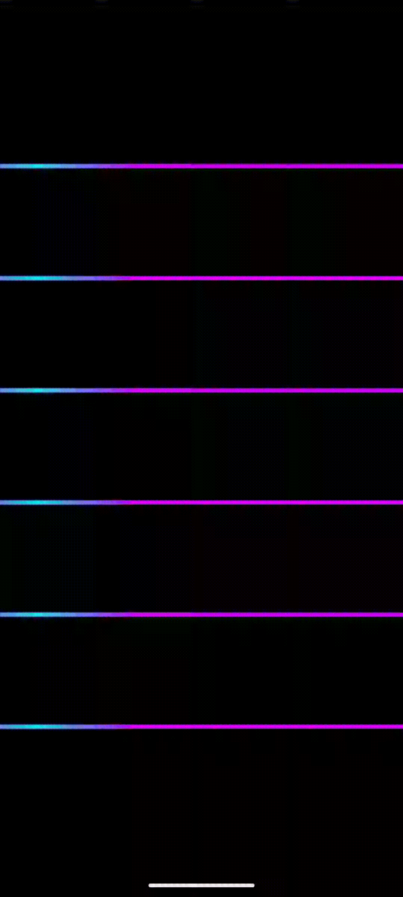
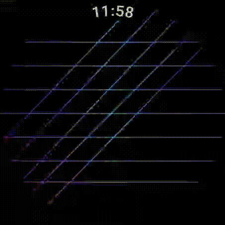

<div align="center">

# ChromaFlow

**ChromaFlow는 선 기반 이미지 위로 네온 글로우가 흘러가는 스윕 애니메이션을 적용하는 Jetpack Compose 라이브러리입니다.**
컬러 광원이 이미지를 가로질러 연속적으로 흐르며, 불투명 픽셀에만 정확하게 마스킹되어
선, 윤곽선, 세밀한 디테일의 형태를 그대로 따라 빛납니다.

> **참고:** ChromaFlow는 현재 **투명 배경을 가진 선 기반 이미지** (네온 사인, 회로 기판, 아웃라인 일러스트 등) 를 지원합니다.
> 다른 이미지 유형에 대한 지원은 향후 추가될 수 있습니다.

[](https://opensource.org/licenses/Apache-2.0)
[](https://jitpack.io/#M1n9yu23/ChromaFlow)
[](https://android-arsenal.com/api?level=24)

**[English](README.md)**

| Mobile | Wear OS |
|:---:|:---:|
|  |  |

</div>

---

## 특징

- **스윕 글로우 효과** — 컬러 광원이 이미지 위를 가로질러 흐르며, 불투명 픽셀에만 정확하게 적용
- **라이프사이클 인식** — 앱이 백그라운드 또는 AOD 모드로 전환되면 애니메이션이 자동으로 일시 정지되고, `RESUMED` 상태가 되면 재개
- **높은 커스터마이징 자유도** — 글로우 색상, 기본 틴트, 방향, 속도, 그래디언트 폭, 이징, 투명도 조절 가능
- **리컴포지션 효율** — 애니메이션 값을 Canvas 드로우 단계에서만 읽어 불필요한 전체 컴포지션 트리 재구성을 방지
- **Jetpack Compose 외 추가 의존성 없음**

---

## 설치

프로젝트 수준 `settings.gradle.kts`에 JitPack 저장소를 추가합니다:

```kotlin
dependencyResolutionManagement {
    repositories {
        maven { url = uri("https://jitpack.io") }
    }
}
```

모듈 수준 `build.gradle.kts`에 의존성을 추가합니다:

```kotlin
dependencies {
    implementation("com.github.M1n9yu23:ChromaFlow:<version>")
}
```

> `<version>` 자리에 [최신 릴리즈 태그](https://github.com/M1n9yu23/ChromaFlow/releases)를 입력하세요.

---

## 사용법

### 기본 사용

```kotlin
ChromaFlowImage(
    painter = painterResource(R.drawable.my_image),
    contentDescription = "Sample image",
    style = ChromaFlowStyle(glowColor = Color.Cyan),
    modifier = Modifier.fillMaxSize(),
)
```

### 전체 커스터마이즈

```kotlin
ChromaFlowImage(
    painter = painterResource(R.drawable.my_image),
    contentDescription = null,
    modifier = Modifier.size(300.dp),
    style = ChromaFlowStyle(
        glowColor = Color.Cyan,
        baseColor = Color.DarkGray,
        durationMillis = 1500,
        glowAlpha = 0.8f,
        gradientWidth = 200.dp,
        direction = ChromaFlowDirection.LEFT_TO_RIGHT,
        easing = FastOutSlowInEasing,
    ),
)
```

---

## ChromaFlowStyle

| 파라미터 | 타입 | 기본값 | 설명 |
|---|---|---|---|
| `glowColor` | `Color` | `Color.Unspecified` | 스윕 글로우의 색상. `Unspecified`이면 애니메이션 비활성화. |
| `baseColor` | `Color` | `Color.Unspecified` | 원본 이미지에 적용할 틴트 색상. `Unspecified`이면 원본 유지. |
| `durationMillis` | `Int` | `2500` | 한 번 스윕하는 데 걸리는 시간 (밀리초). |
| `glowAlpha` | `Float` | `0.9f` | 그래디언트 중심부의 최대 불투명도 (`0f`–`1f`). |
| `gradientWidth` | `Dp` | `300.dp` | 스윕 그래디언트 밴드의 너비. |
| `direction` | `ChromaFlowDirection` | `BIDIRECTIONAL` | 글로우가 흐르는 방향. |
| `easing` | `Easing` | `LinearEasing` | 각 스윕 패스에 적용되는 이징 커브. |

---

## ChromaFlowDirection

| 값 | 설명 |
|---|---|
| `LEFT_TO_RIGHT` | 왼쪽에서 오른쪽으로 스윕 후 즉시 초기화. |
| `RIGHT_TO_LEFT` | 오른쪽에서 왼쪽으로 스윕 후 즉시 초기화. |
| `BIDIRECTIONAL` | 왼쪽 → 오른쪽 → 왼쪽으로 연속 스윕 (기본값). |

---

## ChromaFlowDefaults

스타일 일부만 재정의할 때 기본값을 참조할 수 있습니다:

```kotlin
ChromaFlowStyle(
    glowColor = Color.Magenta,
    durationMillis = ChromaFlowDefaults.DURATION_MILLIS / 2, // 두 배 빠르게
)
```

| 상수 | 값 |
|---|---|
| `DURATION_MILLIS` | `2500` |
| `GLOW_ALPHA` | `0.9f` |
| `gradientWidth` | `300.dp` |
| `direction` | `ChromaFlowDirection.BIDIRECTIONAL` |
| `easing` | `LinearEasing` |

---

## 요구 사항

- Android **API 24+**
- Jetpack Compose

---

## 기여

버그 수정, 새로운 애니메이션 스타일, 선 기반 이미지를 넘어서는 지원 확장까지 — 모든 기여를 환영합니다.
좋은 아이디어나 개선 사항이 있다면 PR이나 이슈를 열어주세요.

자세한 내용은 [CONTRIBUTING.md](CONTRIBUTING.md)를 참고하세요.

---

## 라이선스

```
Copyright 2026 Gyugle

Licensed under the Apache License, Version 2.0 (the "License");
you may not use this file except in compliance with the License.
You may obtain a copy of the License at

    http://www.apache.org/licenses/LICENSE-2.0

Unless required by applicable law or agreed to in writing, software
distributed under the License is distributed on an "AS IS" BASIS,
WITHOUT WARRANTIES OR CONDITIONS OF ANY KIND, either express or implied.
See the License for the specific language governing permissions and
limitations under the License.
```
